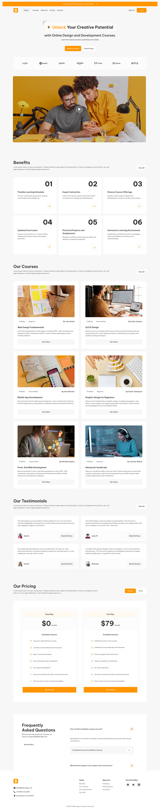
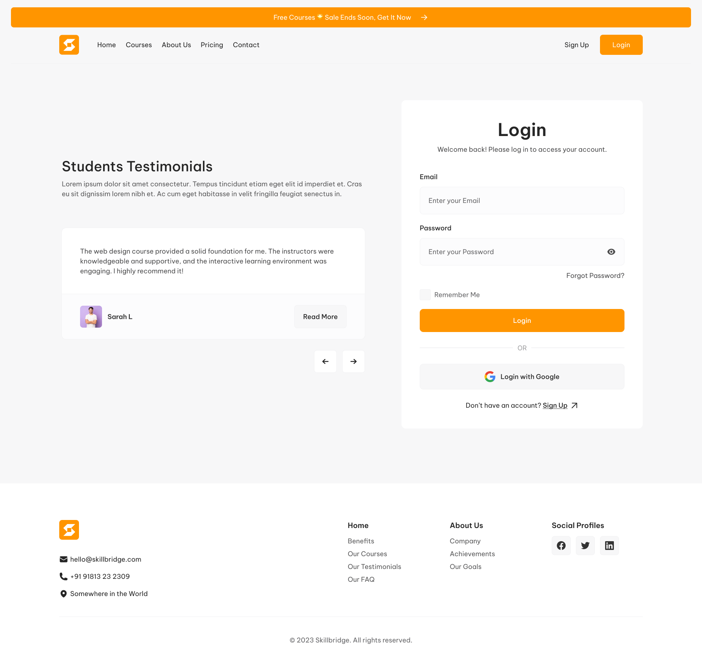
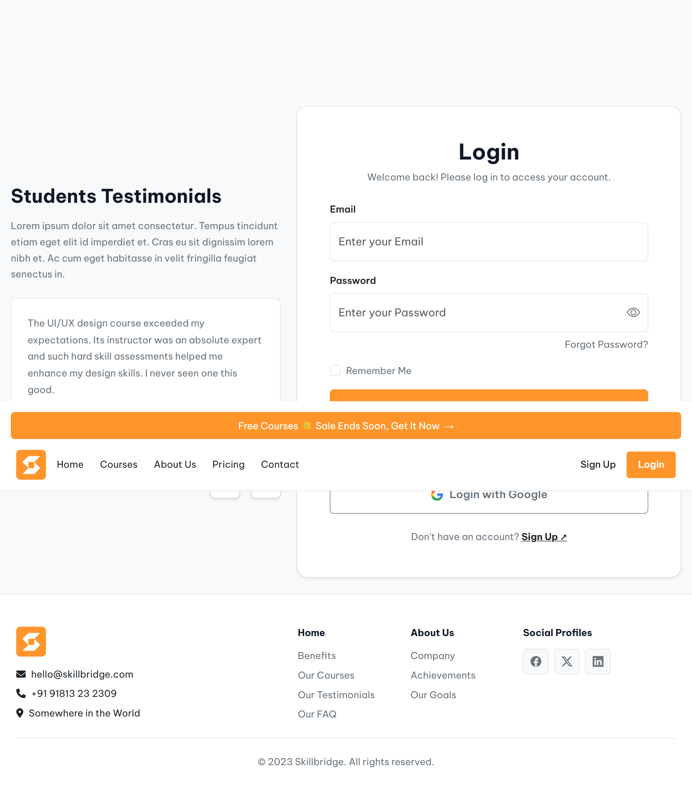
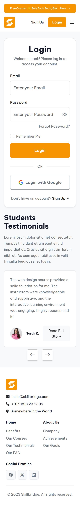
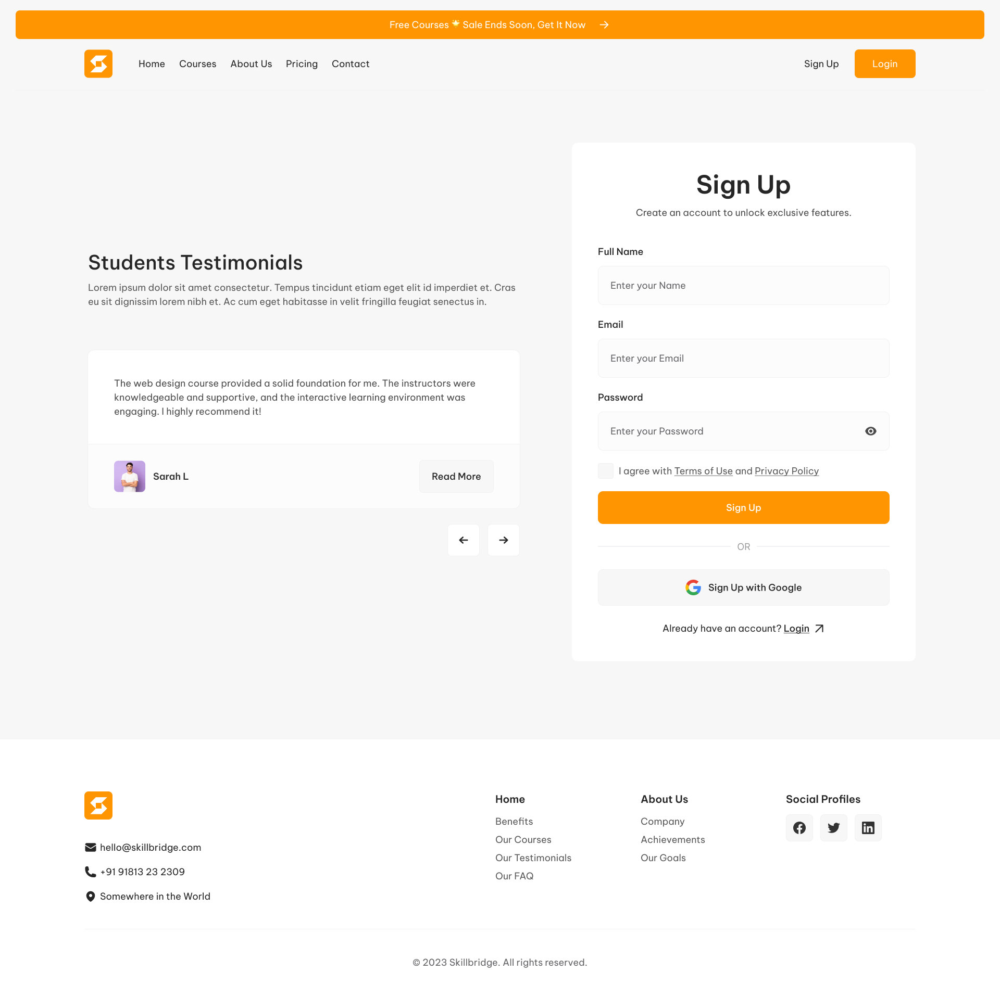
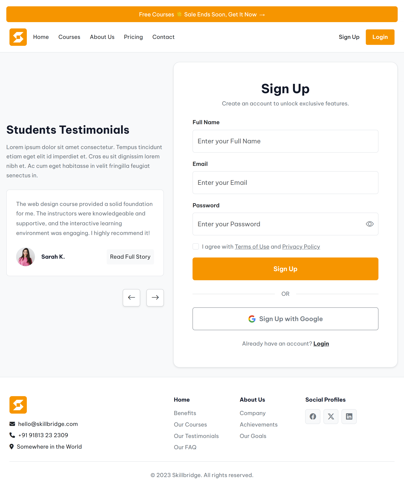
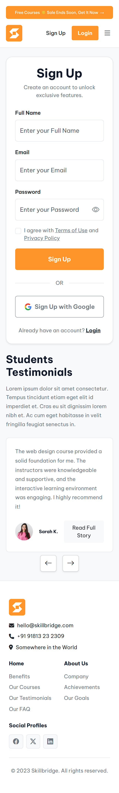

# Responsive E-Learning Platform UI

A responsive multi-page e-learning website built using **HTML5**, **CSS3**, and **Bootstrap 5**.

This project was developed as part of my front-end development learning journey to practice translating a professional UI design into a fully responsive website. It demonstrates my understanding of semantic HTML, responsive layouts, Bootstrap components, and clean project organization.

---

## 📖 Project Overview

The project recreates the interface of a modern e-learning platform from a Figma design provided during a frontend development course.

The objective was to accurately implement the supplied design while ensuring responsiveness across different screen sizes and maintaining a clean, maintainable codebase.

The project currently consists of:

- Home page
- Login page
- Sign Up page

All pages are responsive and optimized for desktop and mobile devices.

---

## ✨ Features

- Responsive multi-page website
- Mobile-first responsive layout
- Bootstrap 5 Grid System
- Responsive navigation
- Modern UI components
- Login page
- Sign Up page
- Reusable CSS structure
- Organized project architecture
- Cross-device compatibility

---

## 🛠 Technologies Used

- HTML5
- CSS3
- Bootstrap 5
- Bootstrap Icons
- Google Fonts
- Font Awesome

---

## 📁 Project Structure

```text
responsive-elearning-website/
│
├── assets/
│   ├── css/
│   │   ├── bs/
│   │   ├── login.css
│   │   ├── signup.css
│   │   └── styles.css
│   │
│   ├── images/
│   │   ├── icons/
│   │   ├── image/
│   │   └── screenshots/
│   │
│   └── js/
│
├── pages/
│   ├── login.html
│   └── signup.html
│
├── index.html
├── README.md
└── .gitignore
```

---

## 🎯 What I Learned

Through this project I practiced:

- Semantic HTML
- Responsive web design
- Bootstrap 5 Grid System
- Bootstrap utility classes
- CSS organization
- Responsive layouts
- Mobile-first development
- Translating UI designs into code
- Front-end project organization

---

## 🎨 Design Reference

The user interface implemented in this project is based on a Figma design provided as part of a frontend development course.

The original design was created by the course instructor/team and shared with students through a private Figma workspace for educational purposes. Access to the design file was granted to enable students inspect layout specifications, typography, spacing, colors, and assets while recreating the interface.

As the design file is privately managed by the course, it is **not included in this repository**.

---

# 📸 Screenshots

## Home Page

### Original Figma Design



### Desktop Preview


### Mobile Preview


---

## Login Page

### Original Figma Design



### Desktop Preview



### Mobile Preview



---

## Sign Up Page

### Original Figma Design



### Desktop Preview



### Mobile Preview



---

## 🌐 Live Demo

GitHub Pages:

> *(Deployment link will be added after publishing.)*

---

## 🔮 Future Improvements

As I continue learning JavaScript and modern front-end development, I plan to improve this project by:

- Adding interactive functionality using JavaScript
- Implementing client-side form validation
- Improving accessibility (WCAG)
- Optimizing performance
- Enhancing animations and transitions
- Improving SEO
- Refactoring the project into reusable components using a JavaScript framework such as React

---

## 👨‍💻 About Me

I'm currently learning Front-End Development and building projects to strengthen my skills in creating responsive, accessible, and user-friendly web applications.

This repository represents one of my learning projects and forms part of my growing software development portfolio.

---

## 📄 License

This repository is intended for educational and portfolio purposes.

The website implementation is my own work.

The original UI design used as reference was provided through a private frontend development course and remains the intellectual property of its respective creator(s).